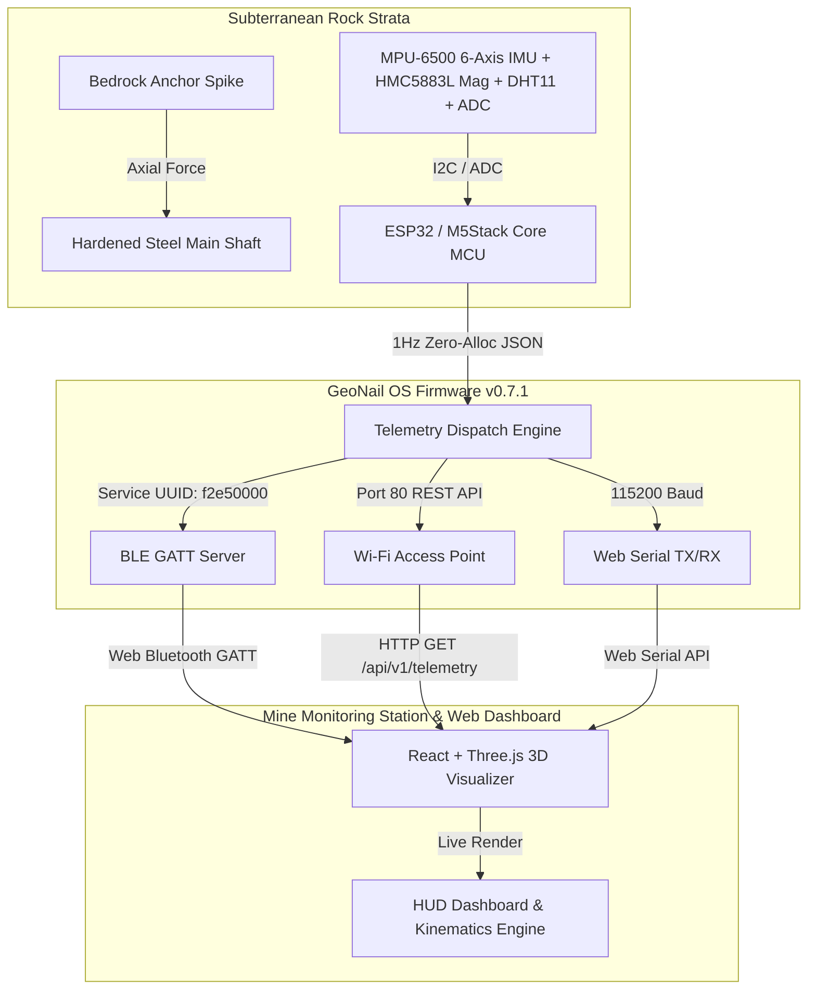
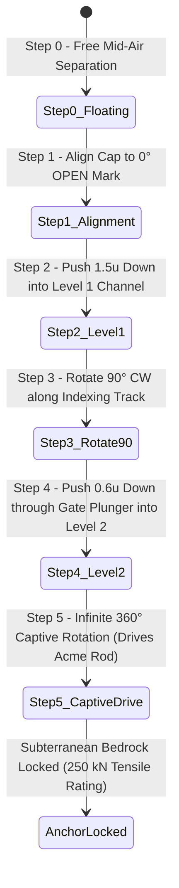

<div align="center">

# 🏔️ GeoNail Subterranean System
### *Smart India Hackathon (SIH 2026) — Problem Statement Solution #SIH26025*

[](https://github.com/Yogarathinam/GeoNail_SIH26025)
[](file:///e:/SIH/firmware/GeoNail_M5Stack_Firmware.ino)
[](file:///e:/SIH/sih-3d-visualizer)
[](#license)

<br />

**GeoNail** is an advanced, multi-transport early warning geotechnical rock anchor and subterranean telemetry monitoring system. Engineered for open-pit mines, underground tunnels, and landslide-prone slopes, it combines **heavy-duty mechanical bedrock locking mechanisms** with **real-time 6-DOF IMU motion, vibration, magnetic, and environmental telemetry** broadcasted seamlessly via **BLE GATT, Wi-Fi REST, and Web Serial**.

[Explore 3D Visualizer App](file:///e:/SIH/sih-3d-visualizer) • [View Firmware Code](file:///e:/SIH/firmware/GeoNail_M5Stack_Firmware.ino) • [Live HTML Dashboard](file:///e:/SIH/firmware/geonail_dashboard_debug.html)

</div>

---

## 👨‍💻 Team Stellar Roster

> [!NOTE]
> Developed by **Team Stellar** from **R.M.D. Engineering College** for Smart India Hackathon (SIH).

| Role | Name | Email Contact | Institutional Affiliation |
| :--- | :--- | :--- | :--- |
| 👑 **Team Leader** | **YOGARATHINAM T L** | `23104177@rmd.ac.in` | R.M.D. Engineering College |
| 🛡️ Team Member | **Goutham V** | `23104180@rmd.ac.in` | R.M.D. Engineering College |
| ⚙️ Team Member | **Sanjay Kumar K** | `23104142@rmd.ac.in` | R.M.D. Engineering College |
| 🔬 Team Member | **Saravan kumaar R** | `23104146@rmd.ac.in` | R.M.D. Engineering College |
| 📊 Team Member | **Thangaroja K** | `23104163@rmd.ac.in` | R.M.D. Engineering College |
| 🎨 Team Member | **Yogasree V** | `23104178@rmd.ac.in` | R.M.D. Engineering College |

---

## 🎯 Executive Summary & Jury Value Proposition

Mine disasters, rockbursts, and slope collapses are primarily caused by undetectable sub-surface displacement and micro-vibrations inside rock strata. Traditional monitoring relies on manual surveys or costly wired extensometers.

**GeoNail** solves this with an integrated end-to-end hardware-software ecosystem:

> [!IMPORTANT]
> **Key Innovations for SIH Jury Evaluation**:
> 1. **Two-Stage Captive Bayonet & Acme Screw Anchor**: Pneumatically driven into subterranean bedrock with dual-opposed rotary locking tabs capable of withstanding 250 kN pull-out force.
> 2. **Multi-Transport Zero-Deallocation Firmware**: Custom ESP32 C++ firmware (GeoNail OS v0.7.1) streaming 1Hz single-packet JSON telemetry over Web Bluetooth (BLE GATT), Wi-Fi Access Point REST API, and Web Serial simultaneously.
> 3. **Interactive 3D Kinematics & HUD Visualizer**: WebGL/Three.js-powered digital twin rendering real-time roll, pitch, acceleration, vibration, subterranean strata depth, and emergency geo-event alerts.

---

## 📐 System Architecture & Data Flow



---

## ⚙️ Operational Kinematics & Subterranean Anchor Workflow



---

## 📊 Telemetry Data Schema & Sensor Integration

The system reads 5 sensor modules simultaneously and packages a compact ~340-byte JSON telemetry payload:

```json
{
  "device": {
    "node_id": "GN-001",
    "name": "GeoNail Node 001",
    "location": "ZONE-A",
    "firmware": "0.7.1"
  },
  "timestamp_ms": 264108,
  "motion": {
    "roll": -163.86,
    "pitch": 93.38,
    "acceleration": 0.99,
    "vibration": 0.007,
    "vibration_level": "LOW"
  },
  "magnetic": {
    "magnitude_ut": 40.0,
    "calibrated": false
  },
  "environment": {
    "temperature_c": 32.9,
    "humidity_percent": 89.9,
    "soil_raw": 1238,
    "mq7_raw": 4095
  },
  "sensor_status": {
    "mpu6500": "HEALTHY",
    "hmc5883l": "UNCALIBRATED",
    "dht11": "HEALTHY"
  },
  "status": {
    "overall": "NORMAL"
  }
}
```

---

## 🔌 Hardware Pinout & Communication Protocols

| Sensor / Module | Protocol | ESP32 / M5Stack Pin | Specification |
| :--- | :--- | :--- | :--- |
| **MPU-6500 IMU** | I2C (Address `0x68`) | SDA: `GPIO 21`, SCL: `GPIO 22` | 3-axis Accel + 3-axis Gyro |
| **HMC5883L Mag** | I2C (Address `0x1E`) | SDA: `GPIO 21`, SCL: `GPIO 22` | 3-axis Subterranean Magnetic Field |
| **DHT11 Temp/Hum** | Single Wire | `GPIO 26` | Operating Temp: -20°C to +60°C |
| **Soil Moisture ADC** | Analog Input | `GPIO 34` (ADC1_CH6) | 12-bit Resolution (0–4095) |
| **MQ-7 Gas Sensor** | Analog Input | `GPIO 36` (ADC1_CH0) | Carbon Monoxide Subterranean Monitor |
| **BLE GATT Service** | Bluetooth Low Energy | UUID: `f2e50000-6c9b-4bd4-8c39-4f3c7e000001` | Read + Notify (`f2e50001-...`) |
| **Wi-Fi REST API** | HTTP Server | SSID: `GeoNail-AP` (`192.168.4.1`) | Port 80 Endpoint: `/api/v1/telemetry` |

---

## 🚀 Quick Start Guide

### 1. Hardware Firmware Flash
1. Open [GeoNail_M5Stack_Firmware.ino](file:///e:/SIH/firmware/GeoNail_M5Stack_Firmware.ino) in Arduino IDE.
2. Install required libraries: `M5Unified`, `ArduinoJson`, `DHT sensor library`, `Adafruit Unified Sensor`.
3. Select Board: **M5Stack-Core-ESP32** (or Generic ESP32 Dev Module).
4. Flash the sketch via USB-C at 115200 baud.

### 2. Launch 3D Visualizer Web Application
```bash
# Navigate to web visualizer folder
cd sih-3d-visualizer

# Install dependencies
npm install

# Start local dev server
npm run dev
```

### 3. Connect Live Dashboard
1. Open `http://localhost:5173` or open [geonail_dashboard_debug.html](file:///e:/SIH/firmware/geonail_dashboard_debug.html) directly in Chrome.
2. Click **Connect BLE** (Select `GeoNail Node 001`) or **Connect Serial** (115200 baud).
3. Observe live 3D rock nail rotation, roll/pitch gauge changes, and real-time vibration alerts!

---

## 📂 Repository Structure

```
├── firmware/
│   ├── GeoNail_M5Stack_Firmware.ino   # Main GeoNail OS v0.7.1 C++ Firmware
│   ├── geonail_dashboard_debug.html  # Standalone Live Debug Dashboard (Chrome Web BLE)
│   └── GeoNail_BLE_Test.ino          # Standalone Verification Sketch
├── sih-3d-visualizer/                 # React 3D Digital Twin & HUD Web App (Three.js/Vite)
│   ├── src/
│   │   ├── components/
│   │   │   ├── MCUTelemetryDashboard.tsx # BLE/Serial Transport & Telemetry HUD
│   │   │   ├── LithoPinAssembly.tsx      # 3D Rock Anchor CAD Kinematics Model
│   │   │   └── UndergroundShaft.tsx      # Subterranean Mine Shaft Scene
│   │   └── App.tsx
│   └── package.json
├── docs/                             # Physical CAD & Kinematic Specifications
│   ├── Component_Architecture_and_Kinematics.md
│   ├── GeoNail_Physical_System_Documentation.md
├── SIH.code-workspace                # VS Code Workspace Configuration
└── README.md                         # Project Documentation
```

---

<div align="center">

### 🏆 Team Stellar — SIH 2026
*Protecting subterranean mining operations through intelligent hardware and digital twin technology.*

</div>
