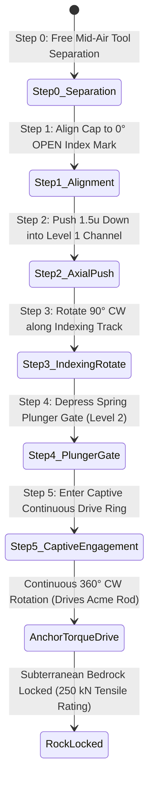
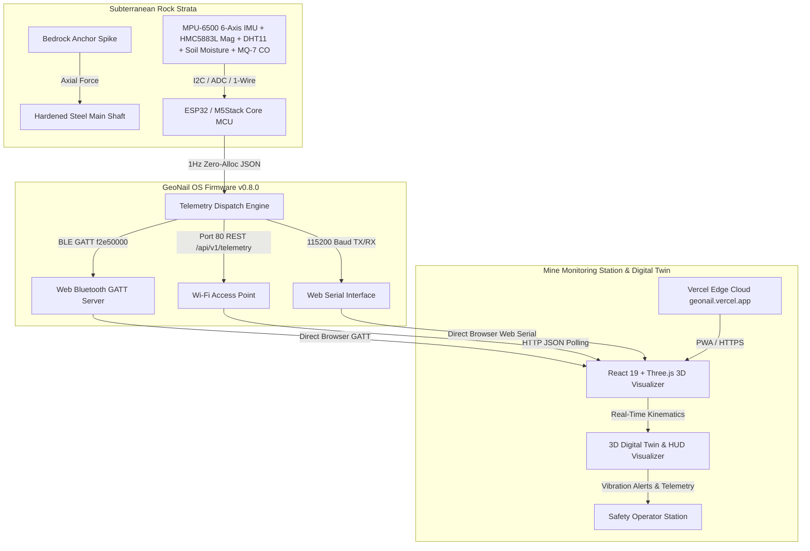
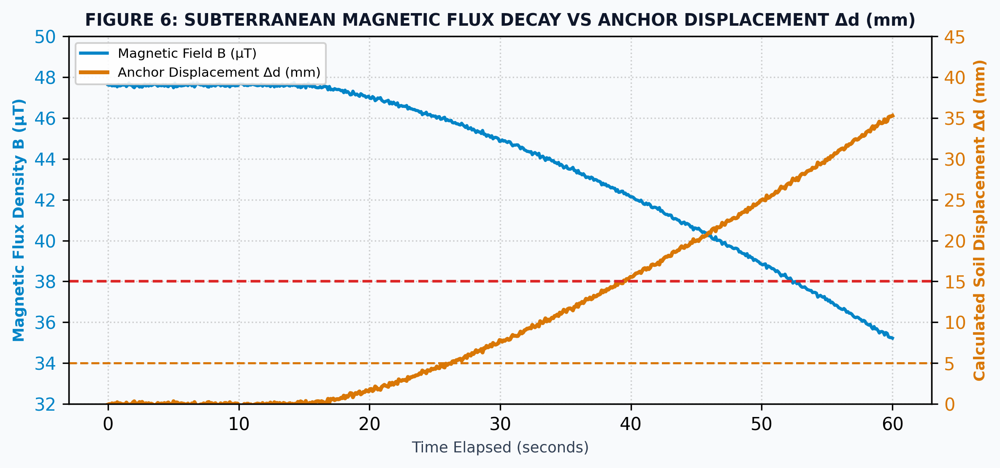
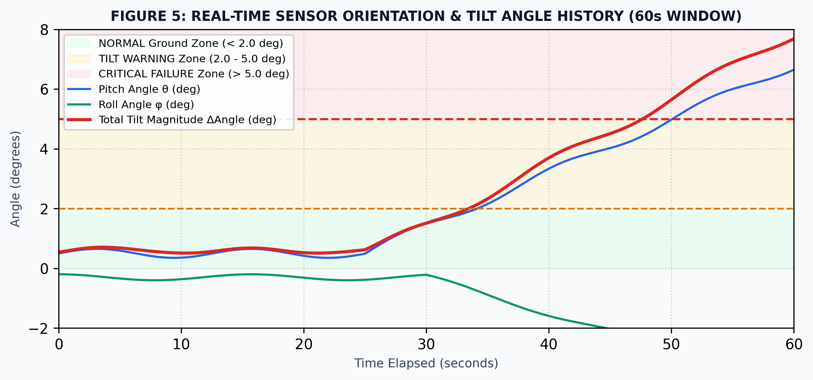
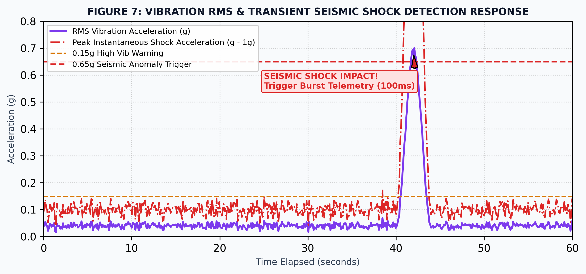

<div align="center">

# GeoNail™ Subterranean Monitoring System
### Intelligent Sub-Surface Rock Anchor, Multi-Transport Edge Telemetry & 3D Digital Twin
#### Smart India Hackathon 2026 (SIH 2026) — Problem Statement Solution #SIH26025

<br />

[](https://geonail.vercel.app/)
[](https://github.com/Yogarathinam/GeoNail_SIH26025)
[](https://rmd.ac.in)
[](./firmware/GeoNail_M5Stack_Firmware.ino)
[](./docs/GeoNail_System_Architecture_and_Technical_Documentation.pdf)
[](./LICENSE)

<br />

<!-- Professional Icon Navigation Bar -->
<p align="center">
  <a href="https://geonail.vercel.app/" target="_blank"></a>
  <a href="#prototype-cad-exploded-view"></a>
  <a href="#team-xlr8-roster"></a>
  <a href="#executive-summary--sih-value-proposition"></a>
  <a href="#mechanical-kinematics--subterranean-locking"></a>
  <a href="#multi-transport-telemetry-architecture"></a>
  <a href="#geotechnical-sensor-data--field-plots"></a>
  <a href="#3d-digital-twin-visualizer"></a>
  <a href="#official-releases--deployments"></a>
  <a href="#quick-start-guide"></a>
</p>

<p align="center">
  <a href="https://geonail.vercel.app/" target="_blank"><strong>Live Production App (geonail.vercel.app)</strong></a> &bull;
  <a href="#prototype-cad-exploded-view">CAD Animation</a> &bull;
  <a href="#team-xlr8-roster">Team Roster</a> &bull;
  <a href="#executive-summary--sih-value-proposition">Executive Summary</a> &bull;
  <a href="#mechanical-kinematics--subterranean-locking">Mechanical Kinematics</a> &bull;
  <a href="#multi-transport-telemetry-architecture">Telemetry Architecture</a> &bull;
  <a href="#geotechnical-sensor-data--field-plots">Field Plots</a> &bull;
  <a href="#official-releases--deployments">Releases & Deployments</a> &bull;
  <a href="#quick-start-guide">Quick Start</a>
</p>

---

</div>

<br />

## Prototype CAD Exploded View

> [!TIP]
> **Dynamic CAD Kinematics Model**: Below is the animated vector blueprint of the GeoNail assembly illustrating its 7-tier mechanical separation, two-stage captive bayonet mechanism, central Acme threaded rod, internal sensor core, and tungsten carbide bedrock spike.

<div align="center">
  <a href="./view_geonail_animation.html" title="Click to open interactive animated viewer with Zoom/Pan & Play/Pause controls">
    
  </a>
  <p><em>Figure 1: Full-assembly exploded view kinematics animation. Click image or <a href="./view_geonail_animation.html">launch the Interactive SVG Controller</a> to zoom, pan, or pause stages.</em></p>
</div>

<br />

<div align="center">

| Technical Asset | Format & Description | Interface Link |
| :--- | :--- | :--- |
| **Live Cloud Application** | **[GeoNail \| Mine Safety Monitoring System](https://geonail.vercel.app/)** — Production WebGL 3D Twin & Telemetry HUD | [Launch geonail.vercel.app](https://geonail.vercel.app/) |
| **Exploded Kinematics CAD** | Dynamic 6-tier expanding & contracting vector CAD animation | [Open Animated Viewer](./view_geonail_animation.html) |
| **Translucent CAD Blueprint** | 1200 DPI vector technical blueprint with component callouts | [Open Blueprint Viewer](./view_geonail_diagram.html) |
| **Complete System Spec PDF** | 30+ Page XeLaTeX comprehensive engineering specification | [Download Technical PDF](./docs/GeoNail_System_Architecture_and_Technical_Documentation.pdf) |
| **Live Web Bluetooth HUD** | Standalone Chrome Web BLE/Serial telemetry dashboard | [Launch Web HUD](./firmware/geonail_dashboard_debug.html) |

</div>

---

## Team XLR8 Roster

> [!NOTE]
> Engineered and developed by **Team XLR8** representing **R.M.D. Engineering College** for **Smart India Hackathon (SIH 2026)**.

<div align="center">

| Project Designation | Member Name | Official Email Contact | Institutional Affiliation |
| :--- | :--- | :--- | :--- |
| **Team Lead & Embedded Firmware Architect** | **YOGARATHINAM T L** | `23104177@rmd.ac.in` | Department of ECE, R.M.D. Engineering College |
| **Mechanical Design & Kinematics Engineer** | **Goutham V** | `23104180@rmd.ac.in` | Department of ECE, R.M.D. Engineering College |
| **Hardware & Sensor Systems Engineer** | **Sanjay Kumar K** | `23104142@rmd.ac.in` | Department of ECE, R.M.D. Engineering College |
| **Wireless Protocols & Telemetry Engineer** | **Saravan kumaar R** | `23104146@rmd.ac.in` | Department of ECE, R.M.D. Engineering College |
| **Data Analytics & Signal Processing Engineer** | **Thangaroja K** | `23104163@rmd.ac.in` | Department of ECE, R.M.D. Engineering College |
| **Digital Twin UI/UX & WebGL Developer** | **Yogasree V** | `23104178@rmd.ac.in` | Department of ECE, R.M.D. Engineering College |

</div>

---

## Executive Summary & SIH Value Proposition

Open-cast mines, sub-surface shafts, and highway cuttings face catastrophic rockbursts, bench sliding, and slope failures. Traditional instrumentation (manual extensometers, crackmeters, and periodic tachymetric surveys) suffers from severe latency, cable shearing, high maintenance costs, and an inability to deliver predictive early warnings before strata deformation occurs.

**GeoNail** is an Internet of Subsurface Things (**IoST**) edge-telemetry platform that unifies high-tensile subterranean mechanical anchorage with continuous multi-spectral geophysical monitoring:

> [!IMPORTANT]
> **Key Innovations for SIH Jury Evaluation**:
> 1. **Two-Stage Captive Bayonet & Acme Screw Anchor**: Pneumatically driven into subterranean bedrock with dual-opposed rotary locking tabs capable of withstanding **250 kN pull-out tensile force**.
> 2. **Multi-Transport Zero-Deallocation Firmware (GeoNail OS v0.8.0)**: Ultra-efficient C++ engine simultaneously streaming 1 Hz real-time JSON packets over **Web Bluetooth (BLE GATT)**, **Wi-Fi Access Point REST API**, and **Web Serial UART**.
> 3. **Integrated 5-Sensor Geophysical Sensing Array**: Sub-millimeter strata displacement via tri-axial accelerometer, tri-axial gyroscope, magnetometer tilt compass, subterranean soil pore moisture, ambient temperature/humidity, and toxic CO gas monitoring.
> 4. **1:1 Scale 3D WebGL Digital Twin Visualizer**: Photorealistic Three.js visualizer rendering live roll/pitch kinematics, strata depth, vibration intensity spectra, and automatic audio-visual emergency alarms, deployed live at [**geonail.vercel.app**](https://geonail.vercel.app/).

---

## Mechanical Kinematics & Subterranean Locking

The GeoNail assembly employs an innovative two-stage locking mechanism engineered to prevent accidental uncoupling during high-vibration rotary drilling, followed by infinite 360° captive drive rotation:



### Mechanical Component Breakdown

```
GEONAIL PROTOTYPE ASSEMBLY
├── [Tier 1] AISI 4340 Hardened Steel Strike Cap (Impact-tolerant tool interface)
├── [Tier 2] Two-Stage Captive Bayonet Collar (J-slot indexing track & lock ring)
├── [Tier 3] Chromoly Sch 80 Outer Casing (Translucent/Hermetic environmental sleeve)
├── [Tier 4] Electronics & Sensor Core (ESP32 MCU, MPU-6500 IMU, HMC5883L, DHT11)
├── [Tier 5] Hardened Acme Threaded Central Rod (Torque-to-thrust transmission)
├── [Tier 6] Dual-Opposed Rotary Locking Crossbar (Bedrock tab deployment)
└── [Tier 7] Tungsten Carbide Rock Penetration Spike (Ultra-hard drilling tip)
```

---

## Multi-Transport Telemetry Architecture



### Telemetry Packet Schema (~340 Bytes)

```json
{
  "device": {
    "node_id": "GN-001",
    "name": "GeoNail Node 001",
    "location": "ZONE-A-SLOPE-4",
    "firmware": "0.8.0"
  },
  "timestamp_ms": 264108,
  "motion": {
    "roll": -12.45,
    "pitch": 4.18,
    "acceleration": 1.02,
    "vibration": 0.007,
    "vibration_level": "LOW"
  },
  "magnetic": {
    "magnitude_ut": 41.2,
    "calibrated": true
  },
  "environment": {
    "temperature_c": 28.4,
    "humidity_percent": 64.2,
    "soil_raw": 1420,
    "mq7_raw": 412
  },
  "sensor_status": {
    "mpu6500": "HEALTHY",
    "hmc5883l": "HEALTHY",
    "dht11": "HEALTHY"
  },
  "status": {
    "overall": "NORMAL"
  }
}
```

---

## Geotechnical Sensor Data & Field Plots

The embedded multi-sensor telemetry engine records real-time physical phenomena within subterranean strata:

<div align="center">

| Subterranean Displacement Analysis | 3-Axis Orientation Kinematics | Tri-Axial Vibration vs Seismic Threshold |
| :---: | :---: | :---: |
|  |  |  |
| *Figure 2: Strata shear micro-displacement (mm)* | *Figure 3: Euler angle pitch/roll drift (deg)* | *Figure 4: Tri-axial acceleration & alarm trigger (g)* |

</div>

---

## Hardware Pinout & Sensor Specifications

| Sub-System / Sensor | Communication Protocol | ESP32 / M5Stack Pinout | Functional Description |
| :--- | :--- | :--- | :--- |
| **MPU-6500 6-Axis IMU** | I2C (`0x68`) | SDA: `GPIO 21`, SCL: `GPIO 22` | Sub-millimeter dynamic tilt, angular velocity & vibration |
| **HMC5883L Magnetometer** | I2C (`0x1E`) | SDA: `GPIO 21`, SCL: `GPIO 22` | 3-Axis subterranean geomagnetic flux orientation |
| **DHT11 Micro-Climate** | 1-Wire Digital | `GPIO 26` | Mine borehole temperature (-20°C to +60°C) & relative humidity |
| **Capacitive Soil Moisture** | Analog ADC1 | `GPIO 34` (ADC1_CH6) | Subterranean pore-water pressure & strata saturation |
| **MQ-7 Hazardous Gas** | Analog ADC1 | `GPIO 36` (ADC1_CH0) | Underground carbon monoxide (CO) concentration detection |
| **BLE GATT Radio** | 2.4 GHz Bluetooth 4.2 | Custom Service UUID | Direct mobile & browser telemetry streaming |
| **Wi-Fi Access Point** | 802.11 b/g/n HTTP | SSID: `GeoNail-AP` (Port 80) | Standalone REST endpoint (`/api/v1/telemetry`) |
| **Hardware Serial** | UART0 @ 115200 Baud | TX: `GPIO 1`, RX: `GPIO 3` | Web Serial browser direct connection |

---

## 3D Digital Twin Visualizer

> [!IMPORTANT]
> **Production Cloud Web Application**:
> The 3D Digital Twin and geotechnical monitoring platform is deployed live on Vercel:
> 
> **[GeoNail | Mine Safety Monitoring System (https://geonail.vercel.app/)](https://geonail.vercel.app/)**
> 
> Operators can connect directly from Google Chrome, Microsoft Edge, or Brave to physical GeoNail anchor nodes via Web Bluetooth Low Energy (BLE GATT) or Web Serial with zero local software setup required.

The codebase for the 3D Digital Twin visualizer is located in [`sih-3d-visualizer`](./sih-3d-visualizer/):

* **Real-Time 6-DOF Kinematics**: Synchronous 3D mesh rotation tracking physical GeoNail movement in real time.
* **Dual Multi-Transport Connectors**: 1-click Web Bluetooth GATT or Web Serial connection right inside standard Chrome/Edge browsers.
* **Subterranean Strata Simulation**: Dynamic underground shaft environment showing depth strata layers and bedrock anchoring status.
* **Interactive HUD Instruments**: Analog gauges for roll, pitch, acceleration, vibration level, ambient climate, and gas safety.
* **Emergency Audio Alarm Synthesizer**: Web Audio API generated sirens when seismic threshold or dangerous slope movement is detected.

---

## Official Releases & Deployments

| Release Target | Version | Environment / Host | Link / Access |
| :--- | :--- | :--- | :--- |
| **Live Production Web Application** | `v1.0.0` | Vercel Global Edge | **[geonail.vercel.app](https://geonail.vercel.app/)** |
| **GitHub Releases & Tags** | `v1.0.0` | GitHub Releases Archive | [GeoNail Releases](https://github.com/Yogarathinam/GeoNail_SIH26025/releases) |
| **Embedded Firmware Core** | `v0.8.0` | ESP32 / M5Stack C++ | [GeoNail_M5Stack_Firmware.ino](./firmware/GeoNail_M5Stack_Firmware.ino) |
| **Engineering Specification** | `v1.0.0` | XeLaTeX / PDF | [GeoNail Technical Documentation PDF](./docs/GeoNail_System_Architecture_and_Technical_Documentation.pdf) |
| **Local 3D Visualizer Source** | `v1.0.0` | Vite + React + Three.js | [sih-3d-visualizer](./sih-3d-visualizer/) |

---

## Quick Start Guide

### 1. Instant Cloud Access (Zero Installation)
Navigate to **[GeoNail | Mine Safety Monitoring System (geonail.vercel.app)](https://geonail.vercel.app/)** in any modern Chromium browser (Google Chrome, Microsoft Edge, Brave) to interact with the full 3D Digital Twin and live hardware telemetry streams.

### 2. Flash GeoNail OS Firmware to Hardware
1. Open [`firmware/GeoNail_M5Stack_Firmware.ino`](./firmware/GeoNail_M5Stack_Firmware.ino) in Arduino IDE or VS Code with PlatformIO.
2. Install required dependencies:
   * `M5Unified`
   * `ArduinoJson` (v6 or v7)
   * `DHT sensor library`
   * `Adafruit Unified Sensor`
3. Select Board: **M5Stack-Core-ESP32** (or Generic ESP32 Dev Module).
4. Connect via USB-C and flash firmware at `115200` baud.

### 3. Run the 3D Digital Twin Visualizer Locally
```bash
# Navigate to the visualizer directory
cd sih-3d-visualizer

# Install dependencies
npm install

# Start Vite development server
npm run dev
```
Open `http://localhost:5173` in a Chromium browser (Google Chrome, Microsoft Edge, or Brave).

### 4. Standalone Live Debug Dashboard (Zero Install)
You can also directly open [`firmware/geonail_dashboard_debug.html`](./firmware/geonail_dashboard_debug.html) in your browser:
* Click **Connect BLE** to pair with `GeoNail Node 001`.
* Or click **Connect Serial** to establish a direct 115200 baud UART stream over USB.

---

## Repository File Structure

```
GeoNail_SIH26025/
├── README.md                                          # Modernized Project Manual & SIH Documentation
├── geonail_prototype_exploded_animation.svg          # Master Animated Exploded View CAD
├── geonail_prototype_transparent.svg                 # High-Resolution Translucent Technical Blueprint
├── view_geonail_animation.html                        # Interactive Animated SVG Controller (Pan/Zoom/Play)
├── view_geonail_diagram.html                          # Interactive Static Blueprint Viewer
├── sih-3d-visualizer/                                 # 3D Digital Twin Web Application (Vite + React + Three.js)
│   ├── src/
│   │   ├── components/
│   │   │   ├── MCUTelemetryDashboard.tsx             # Real-Time Telemetry HUD & Protocol Manager
│   │   │   ├── GeoNailAssembly.tsx                   # 3D Mechanical CAD Model & Kinematics Renderer
│   │   │   └── UndergroundShaft.tsx                  # Subterranean Strata Geological Environment
│   │   ├── App.tsx                                   # Main React Application Container
│   │   └── index.css                                 # Glassmorphic Dark-Mode Design System
│   └── package.json
├── firmware/
│   ├── GeoNail_M5Stack_Firmware.ino                  # GeoNail OS v0.8.0 Production C++ Firmware
│   ├── geonail_dashboard_debug.html                  # Standalone Chrome Web BLE/Serial HUD
│   └── GeoNail_BLE_Test.ino                          # Minimal Bluetooth Verification Sketch
└── docs/
    ├── GeoNail_System_Architecture_and_Technical_Documentation.pdf # Complete 30+ Page XeLaTeX Engineering Specification
    ├── GeoNail_System_Architecture_and_Technical_Documentation.tex # Source XeLaTeX Technical Paper
    ├── GeoNail_System_Architecture_and_Technical_Documentation.md  # Markdown System Architecture Reference
    ├── GeoNail_Physical_System_Documentation.md       # Mechanical Dimensions & Kinematic Tolerances
    ├── Component_Architecture_and_Kinematics.md      # Bayonet Indexing Track Kinematic Spec
    ├── geonail_prototype_diagram.svg                 # Master 1200 DPI Vector Diagram
    ├── plot_displacement.png                         # Subterranean Shear Displacement Plot
    ├── plot_orientation.png                          # 3-Axis Euler Angle Kinematics Plot
    └── plot_vibration.png                            # Tri-Axial Vibration & Seismic Alarm Plot
```

---

<div align="center">

### Team XLR8 — Smart India Hackathon 2026
*Protecting subterranean mining operations & infrastructure through intelligent hardware and digital twin technology.*

<br />

**R.M.D. Engineering College** • Problem Statement #SIH26025 • Category: Hardware & IoT

</div>
